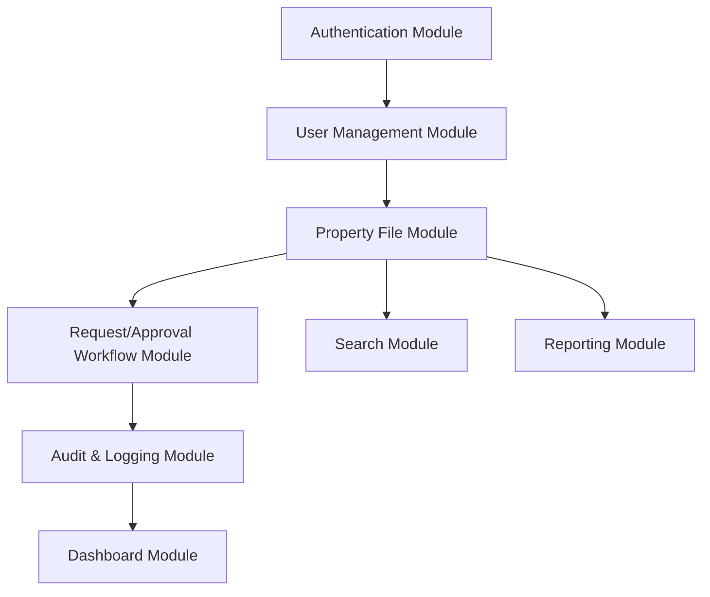
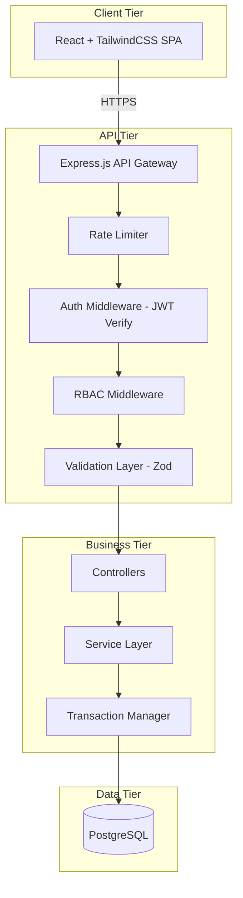
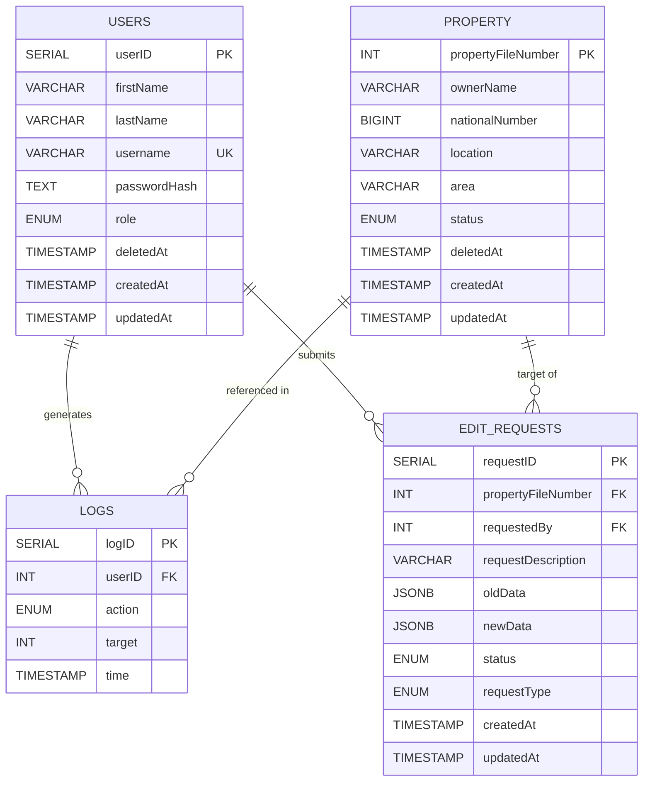
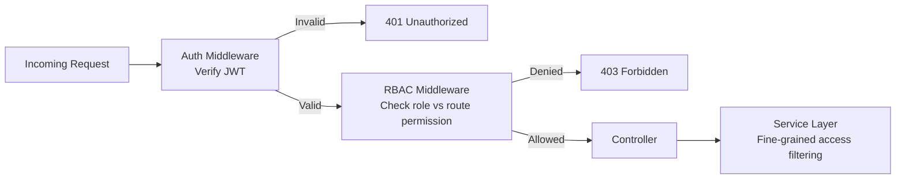
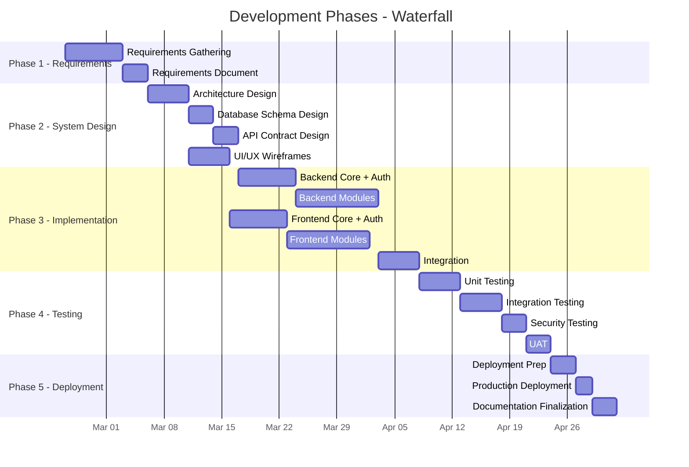
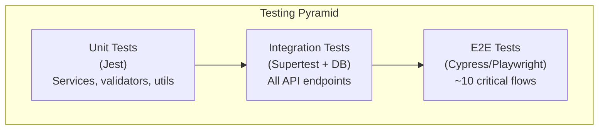
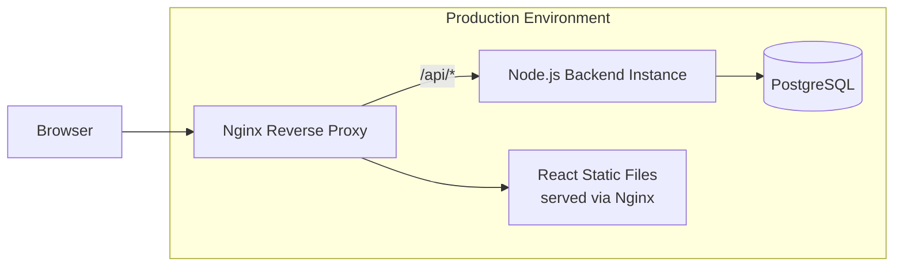
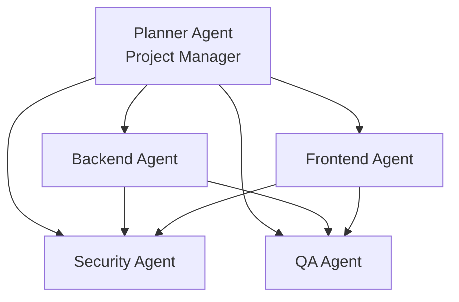

# MASTER EXECUTION PLAN
## Improving Real Estate File Management for the Real Estate Registration Authority

---

> [!IMPORTANT]
> This document is the **single source of truth** for all agents involved in building this system. Every agent must read and comply with this plan before executing any work.

---

## 1. SYSTEM VISION

### 1.1 Mission Statement

Deliver a **secure, auditable, government-grade Property File Management System** that digitizes, protects, and optimizes the lifecycle of property records within the Real Estate Registration Authority — replacing manual paper-based workflows with a traceable digital process.

### 1.2 Strategic Goals

| # | Goal | Success Metric |
|---|------|----------------|
| G1 | Digitize all property file operations | 100% of CRUD operations happen through the system |
| G2 | Enforce role-based access separation | Zero unauthorized data mutations in audit logs |
| G3 | Full audit trail coverage | Every action (view, search, mutate) is logged with actor, timestamp, and target |
| G4 | Approval-gated mutations | Employees cannot directly alter property records; admin approval is mandatory |
| G5 | Data integrity under all conditions | Transactions are atomic; no partial writes |
| G6 | Scalability to national level | Stateless backend, indexed queries, horizontally scalable architecture |

### 1.3 System Boundary

- **In Scope:** Property file CRUD, user management, request/approval workflow, audit logging, reporting (PDF/Excel), authentication, authorization.
- **Out of Scope:** GIS/map integration, external API integrations with other government systems, mobile application, public-facing portal.

---

## 2. FUNCTIONAL MODULES

### Module Map



### 2.1 M1 — Authentication Module

| Aspect | Detail |
|--------|--------|
| Purpose | Secure login/logout with JWT |
| Features | Login, logout, token refresh, session invalidation, account lockout after N failed attempts |
| Tokens | Access Token (15 min, in memory), Refresh Token (HttpOnly, Secure, SameSite=Strict cookie) |
| Dependencies | Users table, bcrypt, JWT library |

### 2.2 M2 — User Management Module

| Aspect | Detail |
|--------|--------|
| Purpose | Admin manages system users |
| Features | Create user, update user, soft-delete user, reset password, list users |
| Access | Admin only |
| Constraints | Username uniqueness, strong password policy enforcement |

### 2.3 M3 — Property File Module

| Aspect | Detail |
|--------|--------|
| Purpose | Core property record management |
| Features | Create, read, update, soft-delete property files |
| Status Flow | `مؤقت` → `مصدق` → `محجوز` (and reverse as needed by admin) |
| Access Rules | Admin: full CRUD. Employee: read-only (restricted view on `محجوز` files) |
| Constraints | `propertyFileNumber` is the business key. Soft delete only (add `deletedAt` column). |

### 2.4 M4 — Request/Approval Workflow Module

| Aspect | Detail |
|--------|--------|
| Purpose | Employees submit change requests; admins approve/reject |
| Request Types | Add, Edit, Delete |
| Data Captured | `oldData` (JSONB snapshot), `newData` (JSONB proposed state), `requestDescription` |
| Status Flow | `في الانتظار` → `مقبول` or `مرفوض` |
| Transaction Rule | On approval, the property mutation + request status update + audit log **must execute in a single DB transaction** |

### 2.5 M5 — Audit & Logging Module

| Aspect | Detail |
|--------|--------|
| Purpose | Immutable record of every system action |
| Logged Actions | Login, logout, add, delete, edit, search, request submission, request approval/rejection |
| Fields | `userID`, `action`, `target` (propertyFileNumber), `timestamp` |
| Constraint | Logs are **append-only**; no update or delete operations permitted |

### 2.6 M6 — Search Module

| Aspect | Detail |
|--------|--------|
| Purpose | Find property files by various criteria |
| Search Fields | `propertyFileNumber`, `ownerName`, `nationalNumber`, `location`, `status` |
| Logging | Every search query is logged (actor, query parameters, timestamp) |
| Access | Both roles; employees see restricted data for `محجوز` files |

### 2.7 M7 — Reporting Module

| Aspect | Detail |
|--------|--------|
| Purpose | Generate exportable reports |
| Formats | PDF, Excel |
| Admin Reports | Full property list, audit trail reports, request history |
| Employee Reports | Limited property list (excluding `محجوز` details) |

### 2.8 M8 — Dashboard Module

| Aspect | Detail |
|--------|--------|
| Purpose | Overview of system statistics |
| Admin View | Total files, files by status, pending requests count, recent activity |
| Employee View | Own submitted requests, their statuses |

---

## 3. NON-FUNCTIONAL REQUIREMENTS

### 3.1 Security

| Requirement | Implementation |
|-------------|----------------|
| Authentication | JWT with short-lived access + HttpOnly refresh tokens |
| Password Storage | bcrypt with ≥12 salt rounds |
| Input Validation | Zod schemas on every endpoint; reject unknown fields (prevent mass assignment) |
| SQL Injection Prevention | Parameterized queries only (via ORM or query builder) |
| HTTP Security Headers | Helmet.js middleware |
| CORS | Whitelist only the frontend origin |
| Rate Limiting | express-rate-limit on auth endpoints (max 5 attempts/15 min) |
| Account Lockout | Lock account after 5 consecutive failed logins; admin unlock required |
| Sensitive File Protection | Backend middleware blocks employee access to `محجوز` file details |

### 3.2 Scalability

| Requirement | Strategy |
|-------------|----------|
| Stateless Backend | No server-side sessions; JWT-based auth |
| Database Indexing | Indexes on `propertyFileNumber`, `nationalNumber`, `status`, `createdAt` |
| Connection Pooling | Use `pg` pool with configurable max connections |
| Horizontal Scalability | Load-balancer ready; no server-local state |

### 3.3 Performance

| Requirement | Target |
|-------------|--------|
| API Response Time | < 300ms for standard CRUD operations |
| Search Response Time | < 500ms for filtered queries (indexed columns) |
| Report Generation | < 5 seconds for up to 10,000 records |
| Concurrent Users | Support ≥50 simultaneous users |

### 3.4 Audit & Compliance

| Requirement | Detail |
|-------------|--------|
| Full Traceability | Every data access and mutation is logged |
| Immutable Logs | No UPDATE/DELETE on `logs` table |
| Data Retention | Logs retained indefinitely (no auto-purge) |
| Soft Delete | No hard deletes on `property` or `users` tables |

### 3.5 Reliability

| Requirement | Detail |
|-------------|--------|
| Data Integrity | All multi-step operations use DB transactions |
| Error Handling | Global error handler; structured error responses |
| Graceful Degradation | System returns meaningful errors, never raw stack traces |

---

## 4. SYSTEM ARCHITECTURE

### 4.1 Logical Architecture Diagram



### 4.2 MVC+ Layer Breakdown

```
server/
├── config/             # Environment config, DB connection, constants
├── middleware/          # auth.js, rbac.js, rateLimiter.js, validate.js, errorHandler.js
├── routes/             # Route definitions grouped by module
│   ├── auth.routes.js
│   ├── user.routes.js
│   ├── property.routes.js
│   ├── request.routes.js
│   ├── log.routes.js
│   └── report.routes.js
├── controllers/        # Request handlers (thin — delegate to services)
├── services/           # Business logic layer
├── models/             # Database models / query builders
├── validators/         # Zod schemas per entity
├── utils/              # Helpers (token generation, password hashing, PDF/Excel generators)
├── tests/              # Unit + integration tests
├── app.js              # Express app setup
└── server.js           # Entry point
```

### 4.3 Key Architecture Principles

1. **Thin Controllers** — Controllers only parse requests, call services, and return responses. Zero business logic.
2. **Fat Services** — All business rules live in the service layer.
3. **Transaction Boundaries** — Services own transaction lifecycle. Controllers never touch the DB directly.
4. **Middleware Pipeline** — Every request passes through: Rate Limiter → Auth → RBAC → Validation → Controller.
5. **Single Responsibility** — Each file has one purpose. Each module is independently testable.

---

## 5. DATABASE DESIGN STRATEGY

### 5.1 Design Principles

| Principle | Application |
|-----------|-------------|
| Soft Delete | Add `deletedAt TIMESTAMP NULL` to `property` and `users` tables; queries filter `WHERE deletedAt IS NULL` |
| Immutable Audit | `logs` table has no UPDATE/DELETE permissions at application level |
| JSONB for Flexibility | `oldData` and `newData` in edit requests store snapshots, enabling schema evolution |
| ENUMs as PostgreSQL Types | Create `CREATE TYPE` for status, role, and action enums |
| Timestamps Everywhere | All tables have `createdAt` and `updatedAt` with `DEFAULT CURRENT_TIMESTAMP` |

### 5.2 Table Relationships



### 5.3 Index Strategy

| Table | Column(s) | Index Type | Rationale |
|-------|-----------|------------|-----------|
| property | `propertyFileNumber` | PRIMARY KEY (B-tree) | Primary lookup |
| property | `nationalNumber` | B-tree | Frequent search field |
| property | `status` | B-tree | Filter by status |
| property | `createdAt` | B-tree | Sorting and date-range queries |
| property | `ownerName` | GIN (trigram) | Partial-match text search (optional for future) |
| logs | `userID` | B-tree | Filter logs by user |
| logs | `time` | B-tree | Time-range queries |
| edit_requests | `status` | B-tree | Filter pending requests |
| edit_requests | `requestedBy` | B-tree | Employee's own requests |

### 5.4 Migration Strategy

- Use a migration tool (e.g., `node-pg-migrate` or `knex` migrations)
- Every schema change is a versioned migration file
- Migrations run in order; rollbacks supported
- Seed scripts for development data (admin user, sample properties)

---

## 6. API DESIGN STANDARDS

### 6.1 Conventions

| Aspect | Standard |
|--------|----------|
| Base URL | `/api/v1` |
| Naming | Plural nouns: `/properties`, `/users`, `/requests`, `/logs` |
| Methods | GET (read), POST (create), PUT (full update), PATCH (partial update), DELETE (soft delete) |
| Response Format | `{ success: boolean, data: T \| null, message: string, errors?: object[] }` |
| Error Format | `{ success: false, message: string, errors: [{ field, message }] }` |
| Status Codes | 200, 201, 204, 400, 401, 403, 404, 409, 422, 429, 500 |
| Pagination | `?page=1&limit=20` → response includes `{ totalCount, totalPages, currentPage }` |
| Sorting | `?sort=createdAt&order=desc` |
| Filtering | `?status=مؤقت&location=عمان` |

### 6.2 Endpoint Map

#### Auth (`/api/v1/auth`)
| Method | Endpoint | Access | Description |
|--------|----------|--------|-------------|
| POST | `/login` | Public | Authenticate user |
| POST | `/logout` | Authenticated | Invalidate refresh token |
| POST | `/refresh-token` | Public (cookie) | Issue new access token |

#### Users (`/api/v1/users`)
| Method | Endpoint | Access | Description |
|--------|----------|--------|-------------|
| GET | `/` | Admin | List all users |
| GET | `/:id` | Admin | Get user details |
| POST | `/` | Admin | Create new user |
| PUT | `/:id` | Admin | Update user |
| DELETE | `/:id` | Admin | Soft-delete user |
| PATCH | `/:id/reset-password` | Admin | Reset user password |
| PATCH | `/:id/unlock` | Admin | Unlock locked account |

#### Properties (`/api/v1/properties`)
| Method | Endpoint | Access | Description |
|--------|----------|--------|-------------|
| GET | `/` | Authenticated | List properties (filtered by role) |
| GET | `/:fileNumber` | Authenticated | Get property detail (restricted for employee + محجوز) |
| POST | `/` | Admin | Create property |
| PUT | `/:fileNumber` | Admin | Update property |
| DELETE | `/:fileNumber` | Admin | Soft-delete property |
| GET | `/search` | Authenticated | Search with query params; logged |

#### Edit Requests (`/api/v1/requests`)
| Method | Endpoint | Access | Description |
|--------|----------|--------|-------------|
| GET | `/` | Admin | List all requests |
| GET | `/my` | Employee | List own requests |
| GET | `/:id` | Authenticated | Get request detail |
| POST | `/` | Employee | Submit new request |
| PATCH | `/:id/approve` | Admin | Approve request (transactional) |
| PATCH | `/:id/reject` | Admin | Reject request |

#### Logs (`/api/v1/logs`)
| Method | Endpoint | Access | Description |
|--------|----------|--------|-------------|
| GET | `/` | Admin | List all logs (paginated, filterable) |

#### Reports (`/api/v1/reports`)
| Method | Endpoint | Access | Description |
|--------|----------|--------|-------------|
| GET | `/properties/pdf` | Authenticated | Export properties to PDF |
| GET | `/properties/excel` | Authenticated | Export properties to Excel |
| GET | `/logs/pdf` | Admin | Export logs to PDF |
| GET | `/logs/excel` | Admin | Export logs to Excel |

### 6.3 Versioning Policy

- API is versioned via URL prefix (`/api/v1`)
- Breaking changes require a new version (`/api/v2`)
- Deprecation notices added via response headers before removal

---

## 7. FRONTEND ARCHITECTURE STRUCTURE

### 7.1 Project Structure

```
client/
├── public/
│   └── index.html
├── src/
│   ├── api/                  # Axios instance, API service functions
│   │   ├── axiosInstance.js   # Base config, interceptors, token refresh
│   │   ├── authApi.js
│   │   ├── propertyApi.js
│   │   ├── requestApi.js
│   │   ├── userApi.js
│   │   ├── logApi.js
│   │   └── reportApi.js
│   ├── components/            # Reusable UI components
│   │   ├── common/            # Button, Input, Modal, Table, Pagination, Spinner
│   │   ├── layout/            # Sidebar, Header, Footer, PageWrapper
│   │   └── forms/             # PropertyForm, RequestForm, UserForm
│   ├── pages/                 # Route-level page components
│   │   ├── Login.jsx
│   │   ├── Dashboard.jsx
│   │   ├── Properties.jsx
│   │   ├── PropertyDetail.jsx
│   │   ├── Requests.jsx
│   │   ├── RequestDetail.jsx
│   │   ├── Users.jsx
│   │   ├── Logs.jsx
│   │   └── NotFound.jsx
│   ├── context/               # React Context providers
│   │   └── AuthContext.jsx
│   ├── hooks/                 # Custom hooks
│   │   ├── useAuth.js
│   │   ├── usePagination.js
│   │   └── useFetch.js
│   ├── guards/                # Route protection
│   │   ├── ProtectedRoute.jsx
│   │   └── RoleGuard.jsx
│   ├── utils/                 # Helpers (date formatting, status mapping, etc.)
│   ├── constants/             # Role definitions, status labels, API base URL
│   ├── styles/                # Global TailwindCSS config overrides
│   ├── App.jsx                # Root component with router
│   └── main.jsx               # Entry point
├── tailwind.config.js
├── postcss.config.js
└── package.json
```

### 7.2 Key Frontend Patterns

| Pattern | Implementation |
|---------|----------------|
| State Management | React Context for auth state; local state + `useFetch` hook for data fetching |
| Routing | React Router v6 with nested layouts |
| Route Protection | `ProtectedRoute` wrapper checks JWT validity; `RoleGuard` checks role |
| Token Management | Access token stored in memory (variable/context); refresh token in HttpOnly cookie |
| API Interceptors | Axios interceptor auto-attaches access token; on 401, attempts silent refresh |
| Error Boundaries | Top-level error boundary for unhandled crashes |
| Form Validation | Client-side validation mirrors Zod schemas (optional: use `react-hook-form` + `zod`) |
| RTL Support | TailwindCSS RTL plugin for Arabic text direction |
| Responsive | Mobile-first responsive design using Tailwind breakpoints |

### 7.3 UI/UX Direction

- **Language:** Interface in Arabic (RTL layout)
- **Theme:** Professional government-style — muted blues, grays, white backgrounds
- **Typography:** Arabic-compatible font (e.g., Cairo, Tajawal from Google Fonts)
- **Notifications:** Toast notifications for success/error feedback
- **Tables:** Sortable, filterable data tables with pagination
- **Modals:** Confirmation dialogs before destructive actions

---

## 8. ROLE-BASED ACCESS CONTROL (RBAC) STRUCTURE

### 8.1 Role Definition Matrix

| Resource / Action | Admin (مدير) | Employee (موظف) |
|-------------------|:---:|:---:|
| Login / Logout | ✅ | ✅ |
| View Dashboard | ✅ (full stats) | ✅ (own requests) |
| List Properties | ✅ | ✅ (restricted `محجوز`) |
| View Property Detail | ✅ | ✅ (blocked if `محجوز`) |
| Create Property | ✅ | ❌ (submit request) |
| Update Property | ✅ | ❌ (submit request) |
| Delete Property | ✅ | ❌ (submit request) |
| Search Properties | ✅ (logged) | ✅ (logged) |
| Submit Request | ❌ | ✅ |
| View All Requests | ✅ | ❌ |
| View Own Requests | ❌ | ✅ |
| Approve/Reject Request | ✅ | ❌ |
| Manage Users | ✅ | ❌ |
| View Logs | ✅ | ❌ |
| Export Full Reports | ✅ | ❌ |
| Export Limited Reports | ✅ | ✅ |

### 8.2 RBAC Implementation Strategy



- **Middleware Level (coarse):** Route-level role check (e.g., only admin can access `/api/v1/users`)
- **Service Level (fine):** Data-level filtering (e.g., employee queries exclude `محجوز` file details)
- **RBAC Config:** Centralized permission map object, not hardcoded in routes

### 8.3 Permission Map Structure (Conceptual)

```
permissions = {
  'GET /api/v1/properties':      ['مدير', 'موظف'],
  'POST /api/v1/properties':     ['مدير'],
  'PUT /api/v1/properties/:id':  ['مدير'],
  'DELETE /api/v1/properties/:id': ['مدير'],
  'POST /api/v1/requests':       ['موظف'],
  'PATCH /api/v1/requests/:id/approve': ['مدير'],
  // ... etc
}
```

---

## 9. DEVELOPMENT PHASES (WATERFALL MODEL)

### Phase Overview



### Detailed Phase Breakdown

#### Phase 1: Requirements Analysis (10 days)
- [x] Gather functional requirements (already provided above)
- [ ] Document non-functional requirements
- [ ] Define use cases and user stories
- [ ] Produce Requirements Specification Document (SRS)
- **Gate:** SRS signed off by project supervisor

#### Phase 2: System Design (16 days)
- [ ] Finalize architecture diagram
- [ ] Complete database schema with migrations
- [ ] Define all API contracts (OpenAPI/Swagger spec)
- [ ] Create UI wireframes for all pages
- [ ] Produce System Design Document (SDD)
- **Gate:** SDD reviewed and approved

#### Phase 3: Implementation (39 days)
- **Sprint 3A — Backend Foundation (7 days)**
  - Express.js project setup with folder structure
  - Database connection + migration runner
  - Auth module (login, logout, refresh, lockout)
  - Middleware pipeline (auth, RBAC, validation, error handler, rate limiter)
- **Sprint 3B — Backend Modules (10 days)**
  - Property CRUD + soft delete
  - Request/Approval workflow with transactions
  - Search with logging
  - Audit log module
  - Reporting (PDF/Excel generation)
  - User management
- **Sprint 3C — Frontend Foundation (7 days)**
  - React project setup with Tailwind + RTL
  - Auth flow (login page, context, guards)
  - Layout components (sidebar, header, page wrapper)
  - Axios instance with interceptors
- **Sprint 3D — Frontend Modules (10 days)**
  - Dashboard page
  - Properties list + detail + search
  - Request submission + listing
  - User management page (admin)
  - Logs viewer (admin)
  - Report export buttons
- **Sprint 3E — Integration (5 days)**
  - Connect frontend to backend
  - End-to-end flow testing
  - Bug fixes and polish
- **Gate:** All features functional in development environment

#### Phase 4: Testing (16 days)
- See Section 10 for detailed testing strategy
- **Gate:** All critical and high-severity bugs resolved

#### Phase 5: Deployment & Documentation (8 days)
- See Sections 12 and 13
- **Gate:** System deployed, documentation complete, project defense ready

---

## 10. TESTING STRATEGY

### 10.1 Testing Pyramid



### 10.2 Test Categories

| Category | Tool | Scope | Coverage Target |
|----------|------|-------|-----------------|
| Unit Tests (Backend) | Jest | Service functions, validators, utility functions | ≥80% |
| Unit Tests (Frontend) | Jest + React Testing Library | Component rendering, hooks, utils | ≥70% |
| Integration Tests (API) | Jest + Supertest | All endpoints with real DB (test database) | 100% of endpoints |
| Security Tests | Manual + OWASP checklist | Auth bypass, injection, IDOR, privilege escalation | All OWASP Top 10 relevant items |
| E2E Tests | Cypress or Playwright | Critical user flows (login, CRUD, approval, export) | 10+ critical flows |

### 10.3 Critical Test Scenarios

| # | Scenario | Type |
|---|----------|------|
| T1 | Login with valid credentials returns tokens | Integration |
| T2 | Login with wrong password increments fail counter | Integration |
| T3 | Account locks after 5 failed attempts | Integration |
| T4 | Expired access token returns 401 | Integration |
| T5 | Refresh token issues new access token | Integration |
| T6 | Employee cannot access admin-only endpoints | Integration |
| T7 | Employee cannot view `محجوز` property details | Integration |
| T8 | Employee request submission creates pending request | Integration |
| T9 | Admin approval mutates property + updates request + logs — atomically | Integration |
| T10 | Admin rejection does not mutate property | Integration |
| T11 | Search operation creates audit log entry | Integration |
| T12 | SQL injection attempt is blocked | Security |
| T13 | Mass assignment attempt is blocked | Security |
| T14 | Rate limiter blocks excessive login attempts | Integration |
| T15 | PDF/Excel report downloads correctly | Integration |
| T16 | Full employee request → admin approval flow | E2E |

### 10.4 Test Environment

- Separate PostgreSQL test database (created/destroyed per test suite)
- Environment variable `NODE_ENV=test`
- Seed data loaded before each test suite
- Tests must be idempotent and isolated

---

## 11. RISK MANAGEMENT PLAN

| # | Risk | Probability | Impact | Mitigation |
|---|------|:-----------:|:------:|------------|
| R1 | SQL Injection | Low | Critical | Parameterized queries only; Zod validation; integration tests |
| R2 | JWT Token Theft | Medium | High | Short-lived access tokens; HttpOnly refresh cookies; HTTPS only |
| R3 | Privilege Escalation | Low | Critical | RBAC middleware + service-level checks; integration tests for every role |
| R4 | Data Loss from Hard Delete | Low | Critical | Soft delete only; `deletedAt` column; no physical DELETE queries |
| R5 | Partial Transaction Failure | Low | High | DB transactions with rollback on any step failure |
| R6 | Scope Creep | High | Medium | Strict phase gates; change requests documented and assessed |
| R7 | Performance Degradation at Scale | Medium | Medium | Indexed queries; connection pooling; load testing before deployment |
| R8 | Single Point of Failure | Medium | High | Stateless backend enables multi-instance deployment |
| R9 | Arabic Encoding Issues | Medium | Low | UTF-8 everywhere; PostgreSQL UTF-8 encoding; test with Arabic data |
| R10 | Audit Log Tampering | Low | Critical | Append-only policy; no DELETE permission on logs table at DB level |

### Contingency Actions

- **R1/R3:** If detected in testing, halt deployment, patch, and re-test
- **R6:** Weekly scope reviews against original requirements
- **R7:** Conduct load tests with 1,000+ records before Phase 5
- **R9:** Include Arabic characters in all seed data and tests

---

## 12. DEPLOYMENT STRATEGY

### 12.1 Environment Tiers

| Environment | Purpose | Database |
|-------------|---------|----------|
| Development | Local developer workstation | Local PostgreSQL |
| Testing | Automated test execution | Ephemeral test DB |
| Staging | Pre-production validation | Staging PostgreSQL |
| Production | Live system | Production PostgreSQL |

### 12.2 Deployment Architecture



### 12.3 Deployment Checklist

- [ ] Set `NODE_ENV=production`
- [ ] Build React app (`npm run build`)
- [ ] Run database migrations
- [ ] Seed admin user (first-time only)
- [ ] Configure environment variables (DB credentials, JWT secret, CORS origin)
- [ ] Enable HTTPS (TLS certificate)
- [ ] Configure Nginx reverse proxy
- [ ] Enable PM2 or systemd for Node.js process management
- [ ] Verify rate limiting is active
- [ ] Verify Helmet headers are present
- [ ] Smoke test all critical flows
- [ ] Verify audit logs are being recorded

### 12.4 Environment Variables Required

| Variable | Description |
|----------|-------------|
| `DATABASE_URL` | PostgreSQL connection string |
| `JWT_ACCESS_SECRET` | Secret for signing access tokens |
| `JWT_REFRESH_SECRET` | Secret for signing refresh tokens |
| `ACCESS_TOKEN_EXPIRY` | Token TTL (e.g., `15m`) |
| `REFRESH_TOKEN_EXPIRY` | Refresh TTL (e.g., `7d`) |
| `CORS_ORIGIN` | Allowed frontend origin |
| `NODE_ENV` | `development` / `test` / `production` |
| `PORT` | Server port (default: 3000) |
| `BCRYPT_SALT_ROUNDS` | Salt rounds (≥12) |
| `MAX_LOGIN_ATTEMPTS` | Account lockout threshold (default: 5) |

---

## 13. DOCUMENTATION STRUCTURE

### 13.1 Required Documents

| Document | Phase | Owner |
|----------|-------|-------|
| Software Requirements Specification (SRS) | Phase 1 | Planner Agent |
| System Design Document (SDD) | Phase 2 | Planner Agent |
| API Documentation (Swagger/OpenAPI) | Phase 3 | Backend Agent |
| Database Schema Documentation | Phase 2-3 | Backend Agent |
| User Manual | Phase 5 | Frontend Agent |
| Test Report | Phase 4 | QA Agent |
| Deployment Guide | Phase 5 | Backend Agent |
| Security Audit Report | Phase 4 | Security Agent |
| Project Final Report (Academic) | Phase 5 | Planner Agent |

### 13.2 Code Documentation Standards

- Every service function has JSDoc comments with `@param`, `@returns`, `@throws`
- Every API endpoint has Swagger annotations
- README.md in root with setup instructions
- `.env.example` file with all required variables (no secrets)

---

## 14. AI-AGENT TASK BREAKDOWN

### 14.1 Agent Roster & Responsibilities



---

### 14.2 Planner Agent (Project Manager)

**Role:** Orchestrator. Defines what needs to be built and in what order. Does NOT write code.

| Task ID | Task | Input | Output | Phase |
|---------|------|-------|--------|-------|
| PL-01 | Produce SRS document | User requirements (this document) | SRS.md | P1 |
| PL-02 | Produce SDD document | SRS + architecture decisions | SDD.md | P2 |
| PL-03 | Define API contracts | SDD + module definitions | OpenAPI spec (YAML) | P2 |
| PL-04 | Define DB schema | SDD + data model | SQL migration files | P2 |
| PL-05 | Create wireframes | SDD + UI/UX direction | Wireframe document | P2 |
| PL-06 | Coordinate agent handoffs | Agent outputs | Validated integration | P3-P5 |
| PL-07 | Produce final project report | All deliverables | FinalReport.md | P5 |

---

### 14.3 Backend Agent

**Role:** Implements all server-side code. Follows MVC+ architecture exactly.

| Task ID | Task | Dependencies | Output | Phase |
|---------|------|--------------|--------|-------|
| BE-01 | Initialize Express project with folder structure | PL-02 (SDD) | Project skeleton | P3A |
| BE-02 | Configure PostgreSQL connection + pool | BE-01 | `config/db.js` | P3A |
| BE-03 | Implement migration runner + initial migrations | PL-04 | Migration files | P3A |
| BE-04 | Implement Auth module (login, logout, refresh, lockout) | BE-02 | Auth routes, controller, service | P3A |
| BE-05 | Implement middleware pipeline (auth, RBAC, validation, error handler, rate limiter) | BE-04 | Middleware files | P3A |
| BE-06 | Implement Property CRUD with soft delete | BE-05 | Property module | P3B |
| BE-07 | Implement Request/Approval workflow with transactions | BE-06 | Request module | P3B |
| BE-08 | Implement Search with audit logging | BE-06 | Search service | P3B |
| BE-09 | Implement Audit Log module (append-only) | BE-05 | Log module | P3B |
| BE-10 | Implement User Management (admin only) | BE-05 | User module | P3B |
| BE-11 | Implement Report generation (PDF/Excel) | BE-06 | Report module | P3B |
| BE-12 | Write Swagger/OpenAPI documentation | BE-06 to BE-11 | Swagger spec | P3B |
| BE-13 | Write unit tests for all services | BE-06 to BE-11 | Test files | P4 |
| BE-14 | Write integration tests for all endpoints | BE-06 to BE-11 | Test files | P4 |
| BE-15 | Write seed scripts (admin user, sample data) | BE-03 | Seed files | P3A |

**Constraints for Backend Agent:**
- Never use `any` type patterns; be explicit in all data handling
- All queries must be parameterized
- Never return raw error stack traces to client
- Every write operation must log to audit
- All approval operations must use DB transactions
- Validate ALL inputs with Zod before processing

---

### 14.4 Frontend Agent

**Role:** Implements all client-side code. Follows component structure exactly.

| Task ID | Task | Dependencies | Output | Phase |
|---------|------|--------------|--------|-------|
| FE-01 | Initialize React project with Tailwind + RTL | PL-05 | Project skeleton | P3C |
| FE-02 | Implement design system (theme, colors, typography, common components) | FE-01 | Component library | P3C |
| FE-03 | Implement Auth flow (login page, context, token management) | FE-02, BE-04 | Auth module | P3C |
| FE-04 | Implement route guards (ProtectedRoute, RoleGuard) | FE-03 | Guard components | P3C |
| FE-05 | Implement layout (sidebar, header, page wrapper) | FE-02 | Layout components | P3C |
| FE-06 | Implement Dashboard page | FE-05, BE-06 | Dashboard page | P3D |
| FE-07 | Implement Properties list + detail + search pages | FE-05, BE-06 | Property pages | P3D |
| FE-08 | Implement Request submission + listing pages | FE-05, BE-07 | Request pages | P3D |
| FE-09 | Implement User management page (admin) | FE-05, BE-10 | Users page | P3D |
| FE-10 | Implement Logs viewer page (admin) | FE-05, BE-09 | Logs page | P3D |
| FE-11 | Implement Report export functionality | FE-07, BE-11 | Export feature | P3D |
| FE-12 | Implement toast notifications + loading states | FE-02 | UX polish | P3D |
| FE-13 | Write component unit tests | FE-06 to FE-12 | Test files | P4 |
| FE-14 | Produce User Manual | FE-06 to FE-12 | UserManual.md | P5 |

**Constraints for Frontend Agent:**
- All text must be in Arabic
- Layout must be RTL
- Never store access tokens in localStorage; use in-memory only
- Every API call goes through the centralized Axios instance
- Show loading spinners for all async operations
- Confirm destructive actions with modals
- Handle all API error responses gracefully with user-friendly messages

---

### 14.5 Security Agent

**Role:** Audits and hardens the entire system. Runs after implementation, before deployment.

| Task ID | Task | Dependencies | Output | Phase |
|---------|------|--------------|--------|-------|
| SC-01 | Audit authentication implementation | BE-04, FE-03 | Security findings report | P4 |
| SC-02 | Audit RBAC implementation | BE-05, FE-04 | RBAC audit report | P4 |
| SC-03 | Test for OWASP Top 10 vulnerabilities | BE-06 to BE-11 | Vulnerability report | P4 |
| SC-04 | Verify input validation completeness | BE-06 to BE-11 | Validation audit | P4 |
| SC-05 | Test for privilege escalation paths | BE-05, BE-07 | Escalation test results | P4 |
| SC-06 | Verify audit log completeness and immutability | BE-09 | Log integrity report | P4 |
| SC-07 | Test token security (expiry, refresh, storage) | BE-04, FE-03 | Token security report | P4 |
| SC-08 | Verify HTTPS, Helmet, CORS, rate limiting | BE-05 | Infrastructure security report | P4 |
| SC-09 | Produce final Security Audit Report | SC-01 to SC-08 | SecurityAudit.md | P4 |

**Security Checklist (Must Pass):**
- [ ] No SQL injection possible
- [ ] No XSS vectors
- [ ] No IDOR (Insecure Direct Object Reference) vulnerabilities
- [ ] No privilege escalation paths
- [ ] Tokens expire correctly
- [ ] Refresh token rotation works
- [ ] Account lockout functions correctly
- [ ] Rate limiting blocks brute force
- [ ] Logs cannot be modified or deleted
- [ ] `محجوز` files are truly hidden from employees
- [ ] CORS only allows frontend origin
- [ ] Helmet headers are present on all responses

---

### 14.6 QA Agent

**Role:** Validates the complete system works correctly end-to-end.

| Task ID | Task | Dependencies | Output | Phase |
|---------|------|--------------|--------|-------|
| QA-01 | Execute unit test suite | BE-13, FE-13 | Test results | P4 |
| QA-02 | Execute integration test suite | BE-14 | Test results | P4 |
| QA-03 | Write and execute E2E tests for critical flows | FE-06 to FE-12, BE-all | E2E test files + results | P4 |
| QA-04 | Verify Arabic text rendering (RTL, encoding) | FE-all | Rendering report | P4 |
| QA-05 | Verify pagination, sorting, filtering on all list views | FE-07, FE-08, FE-10 | Functional test results | P4 |
| QA-06 | Verify report generation (PDF/Excel correctness) | FE-11, BE-11 | Report validation | P4 |
| QA-07 | Performance test (response times under load) | Full system | Performance report | P4 |
| QA-08 | Produce final Test Report | QA-01 to QA-07 | TestReport.md | P4 |

**Critical E2E Flows to Test:**
1. Admin login → create property → logout
2. Employee login → search property → view result (verify `محجوز` restriction)
3. Employee submit edit request → Admin approve → verify property updated
4. Employee submit delete request → Admin reject → verify property unchanged
5. 5 failed logins → verify account locked → Admin unlocks
6. Admin export PDF report → verify file downloads
7. Verify all actions appear in audit logs

---

## APPENDIX A: TECHNOLOGY DEPENDENCIES

| Package | Purpose | Version Guidance |
|---------|---------|------------------|
| express | HTTP framework | ^4.18 |
| pg | PostgreSQL client | ^8.x |
| jsonwebtoken | JWT signing/verification | ^9.x |
| bcrypt | Password hashing | ^5.x |
| zod | Input validation | ^3.x |
| helmet | Security headers | ^7.x |
| cors | CORS middleware | ^2.x |
| express-rate-limit | Rate limiting | ^7.x |
| pdfkit or puppeteer | PDF generation | Latest stable |
| exceljs | Excel generation | ^4.x |
| morgan | HTTP request logging | ^1.x |
| dotenv | Environment variables | ^16.x |
| node-pg-migrate | Database migrations | ^6.x |
| react | UI framework | ^18.x |
| react-router-dom | Client routing | ^6.x |
| axios | HTTP client | ^1.x |
| tailwindcss | CSS framework | ^3.x |
| @tailwindcss/forms | Form styling plugin | ^0.5 |
| jest | Testing framework | ^29.x |
| supertest | API testing | ^6.x |
| @testing-library/react | Component testing | ^14.x |

---

## APPENDIX B: NAMING CONVENTIONS

| Entity | Convention | Example |
|--------|-----------|---------|
| Files | camelCase | `propertyService.js` |
| Folders | lowercase | `controllers/`, `services/` |
| Variables | camelCase | `propertyFileNumber` |
| Constants | UPPER_SNAKE_CASE | `MAX_LOGIN_ATTEMPTS` |
| DB Tables | snake_case | `edit_requests` |
| DB Columns | camelCase in app, snake_case in DB | App: `propertyFileNumber` ↔ DB: `property_file_number` |
| API Routes | kebab-case (plural nouns) | `/api/v1/properties` |
| React Components | PascalCase | `PropertyDetail.jsx` |
| CSS Classes | Tailwind utilities | `text-right font-cairo` |

---

## APPENDIX C: EXECUTION SEQUENCE SUMMARY

```
1. Planner Agent → SRS → SDD → API Spec → DB Schema → Wireframes
2. Backend Agent → Project Setup → Auth → Middleware → CRUD → Workflow → Search → Logs → Reports → Tests
3. Frontend Agent → Project Setup → Design System → Auth UI → Layout → Pages → Integration → Tests
4. Security Agent → Auth Audit → RBAC Audit → OWASP Testing → Token Testing → Final Report
5. QA Agent → Unit Tests → Integration Tests → E2E Tests → Performance → Final Report
6. Planner Agent → Final Report → Deployment → Documentation
```

---

> [!CAUTION]
> **No agent may skip a phase or begin implementation before its prerequisite design documents are produced and validated.** The Waterfall model mandates sequential phase completion.

---

# MASTER PLAN READY FOR EXECUTION

